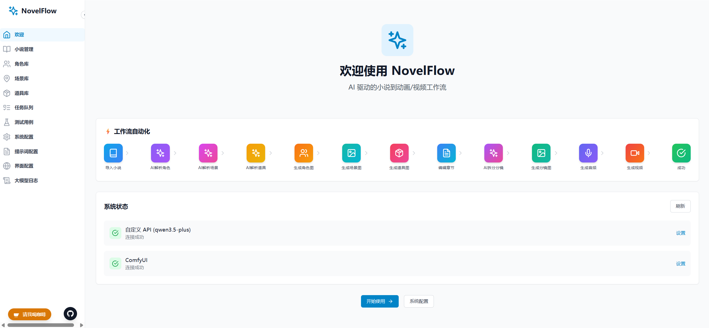
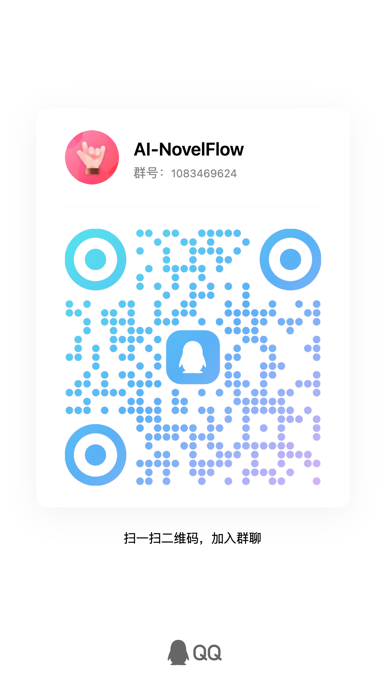

# AI-NovelFlow

**[简体中文](README.md) | [繁體中文](README_TW.md) | [English](README_EN.md) | [日本語](README_JA.md) | [한국어](README_KO.md)**

AI 驱动的小说转视频平台

## 项目概述

NovelFlow 是一个将小说自动转换为视频的 AI 平台。

**核心工作流程：**

```
┌─────────┐    ┌───────────┐    ┌───────────┐    ┌───────────┐    ┌───────────┐
│   小说   │ → │ AI解析角色 │ → │ AI解析场景 │ → │ AI解析道具 │ → │ 生成角色图 │
└─────────┘    └───────────┘    └───────────┘    └───────────┘    └───────────┘
                                                                    ↓
┌───────────┐    ┌───────────┐    ┌───────────┐    ┌───────────┐    ┌───────────┐
│  生成视频  │ ← │  生成音频  │ ← │ 生成分镜图 │ ← │ AI拆分分镜 │ ← │ 生成场景图 │
└───────────┘    └───────────┘    └───────────┘    └───────────┘    └───────────┘
                                                        ↑
                              ┌───────────┐    ┌───────────┐
                              │ 编辑章节  │ ← │ 生成道具图 │
                              └───────────┘    └───────────┘
```

**详细步骤：**
1. **导入小说** - 新建或导入小说文本（支持TXT、EPUB格式）
2. **AI解析角色** - 自动提取角色信息（名称、描述、外貌特征）
3. **AI解析场景** - 自动提取场景信息（场景名称、环境描述）
4. **AI解析道具** - 自动提取道具信息（道具名称、外观描述）
5. **生成角色图** - 为每个角色生成 AI 人设图
6. **生成场景图** - 为每个场景生成参考图
7. **生成道具图** - 为每个道具生成参考图
8. **编辑章节 / AI拆分分镜** - 编辑章节内容，AI自动拆分为分镜
9. **生成分镜图** - 根据分镜描述生成场景图片
10. **生成音频** - 为分镜生成配音/音效（可选）
11. **生成视频** - 使用 Video Director 生成单帧、首尾帧或多关键帧分镜视频，并合并为完整视频

**主要特性：**
- 支持章回体小说解析
- 角色一致性保持（角色形象在多场景中保持一致）
- 场景一致性保持（场景环境在多镜头中保持一致）
- 自动分镜生成和视频合成

## 界面预览



## 视频介绍

### Bilibili

📺 <a href="https://www.bilibili.com/video/BV1VdZbBDEXF" target="_blank">AI-NovelFlow 小说转视频平台介绍</a>

📺 <a href="https://www.bilibili.com/video/BV1rufEBKEjV" target="_blank">如何在我们开源项目里接入商用API</a>

📺 <a href="https://www.bilibili.com/video/BV1G9ZfBeEj6" target="_blank">Windows下如何安装我们的开源项目</a>

### YouTube

📺 <a href="https://www.youtube.com/watch?v=IlMbeDme2F8" target="_blank">AI-NovelFlow 小说转视频平台介绍</a>

📺 <a href="https://www.youtube.com/watch?v=whskvmdN6Qo" target="_blank">如何在我们开源项目里接入商用API</a>

📺 <a href="https://www.youtube.com/watch?v=DybveicQ9eQ" target="_blank">Windows下如何安装我们的开源项目</a>

## 社区交流

| Telegram 交流群 | QQ 群 |
|:---:|:---:|
| <a href="https://t.me/AI_NovelFlow" target="_blank">@AI_NovelFlow</a> | 1083469624 |
|  |  |

## Star History

[](https://star-history.com/#qzw881130/AI-NovelFlow&Date)

## 技术栈

- **前端**: React + TypeScript + Tailwind CSS + Vite
- **状态管理**: Zustand（全局状态 + 国际化/时区状态）
- **后端**: FastAPI + SQLAlchemy + SQLite
- **AI**: DeepSeek API / OpenAI API / Gemini API + ComfyUI
- **视频生成**: MiniMax H3 图生视频、首尾帧视频、多关键帧视频
- **国际化**: 自定义 i18n 实现（5 语言支持）

## 主要功能

- **小说管理**: 支持新建、编辑、删除小说，自动章回体解析
- **角色库**: AI 自动解析角色，支持角色形象生成和一致性保持
- **场景库**: AI 自动解析场景，支持场景参考图生成和环境设定
- **分镜生成**: AI 自动拆分章节为分镜，支持批量生成图片、结构化编辑和状态恢复
- **Video Director**: 支持单帧、首尾帧、三关键帧、四关键帧视频规划，保留每次 AI 调用结果和最终 Prompt
- **视频合成**: 支持将分镜视频和多 Clip 片段合并为完整章节视频
- **工作流管理**: 支持自定义 ComfyUI 工作流，节点映射配置
- **任务队列**: 后台异步任务处理，支持任务状态实时监控
- **预设测试用例**: 内置《小马过河》《小红帽》《皇帝的新装》等测试用例
- **多语言支持**: 支持简体中文、繁体中文、英文、日文、韩文界面
- **时区支持**: 用户可自定义时区，所有时间显示按指定时区转换

## 项目结构

```
AI-NovelFlow/
├── backend/              # FastAPI 后端
│   ├── app/
│   │   ├── api/         # API 路由
│   │   ├── core/        # 核心配置
│   │   ├── models/      # 数据库模型
│   │   ├── repositories/ # 数据仓库层
│   │   ├── schemas/     # Pydantic 模型
│   │   ├── services/    # 业务逻辑（LLM、ComfyUI）
│   │   └── utils/       # 工具函数
│   ├── migrations/      # 数据库迁移脚本
│   ├── prompt_templates/ # 提示词模板文件
│   ├── workflows/       # ComfyUI 工作流配置
│   ├── user_workflows/  # 用户自定义工作流
│   ├── user_story/      # 生成的图片/视频存储目录
│   └── main.py
├── frontend/            # React 前端
│   └── my-app/
│       ├── src/
│       │   ├── components/  # 组件
│       │   ├── i18n/        # 国际化翻译文件
│       │   ├── pages/       # 页面
│       │   ├── stores/      # 状态管理
│       │   └── types/       # TypeScript 类型
│       └── package.json
├── windows_gpu_monitor/ # Windows GPU 监控服务（可选）
│   ├── gpu_monitor.py   # GPU 监控服务
│   ├── requirements.txt # 依赖
│   └── start.bat        # Windows 启动脚本
├── debug/workflows/     # 调试用工作流样例，不作为系统默认加载
└── README.md
```

## 安装部署

### 环境要求

- **Python**: 3.10+
- **Node.js**: 18+
- **ComfyUI**: 已安装并运行（用于图像/视频生成）

### 1. macOS / Linux 安装

#### 后端部署

```bash
# 1. 进入后端目录
cd backend

# 2. 创建虚拟环境
python3 -m venv venv

# 3. 激活虚拟环境
source venv/bin/activate

# 4. 安装依赖
pip install -r requirements.txt

# 5. 启动后端服务
uvicorn app.main:app --reload --host 0.0.0.0 --port 8000
```

后端服务将在 http://localhost:8000 运行

#### 前端部署

```bash
# 1. 进入前端目录
cd frontend/my-app

# 2. 安装依赖
npm install

# 3. 启动开发服务器
npm run dev
```

前端服务将在 http://localhost:5173 运行

---

### 2. Windows 安装

#### 后端部署

**使用 CMD (命令提示符):**

```cmd
:: 1. 进入后端目录
cd backend

:: 2. 创建虚拟环境
python -m venv venv

:: 3. 激活虚拟环境
venv\Scripts\activate.bat

:: 4. 安装依赖
pip install -r requirements.txt

:: 5. 启动后端服务
uvicorn app.main:app --reload --host 0.0.0.0 --port 8000
```

**使用 PowerShell:**

```powershell
# 1. 进入后端目录
cd backend

# 2. 创建虚拟环境
python -m venv venv

# 3. 激活虚拟环境（如果提示执行策略错误，请先运行：Set-ExecutionPolicy -ExecutionPolicy RemoteSigned -Scope CurrentUser）
venv\Scripts\Activate.ps1

# 4. 安装依赖
pip install -r requirements.txt

# 5. 启动后端服务
uvicorn app.main:app --reload --host 0.0.0.0 --port 8000
```

**使用 Git Bash:**

```bash
# 1. 进入后端目录
cd backend

# 2. 创建虚拟环境
python -m venv venv

# 3. 激活虚拟环境
source venv/Scripts/activate

# 4. 安装依赖
pip install -r requirements.txt

# 5. 启动后端服务
uvicorn app.main:app --reload --host 0.0.0.0 --port 8000
```

后端服务将在 http://localhost:8000 运行

#### 前端部署

```bash
# 1. 进入前端目录
cd frontend/my-app

# 2. 安装依赖
npm install

# 3. 启动开发服务器
npm run dev
```

前端服务将在 http://localhost:5173 运行

> **Windows 防火墙提示**
> 
> 如果其他设备无法访问前端服务（如局域网内其他电脑无法打开页面），需要放行 5173 端口：
> 
> **CMD (管理员身份):**
> ```cmd
> netsh advfirewall firewall add rule name="AI-NovelFlow Frontend" dir=in action=allow protocol=tcp localport=5173
> ```
> 
> **PowerShell (管理员身份):**
> ```powershell
> New-NetFirewallRule -DisplayName "AI-NovelFlow Frontend" -Direction Inbound -Protocol TCP -LocalPort 5173 -Action Allow
> ```

---

### 3. Docker 部署（可选）

```bash
# 构建镜像
docker build -t ai-novelflow .

# 运行容器
docker run -p 8000:8000 -p 5173:5173 ai-novelflow
```

---

### 4. 更新升级

#### 后端更新

```bash
cd backend
source venv/bin/activate  # Windows: venv\Scripts\activate

# 拉取最新代码
git pull

# 更新依赖
pip install -r requirements.txt

# 重启服务
```

#### 前端更新

```bash
cd frontend/my-app

# 拉取最新代码
git pull

# 更新依赖
npm install

# 重新启动
npm run dev
```

## API 文档

启动后端后访问: http://localhost:8000/docs

## 配置说明

### 1. LLM API 配置

支持多种 LLM 提供商：
- **DeepSeek**（默认）: https://api.deepseek.com
- **OpenAI**: https://api.openai.com
- **Gemini**: https://generativelanguage.googleapis.com
- **Anthropic**: https://api.anthropic.com
- **Azure OpenAI**: 自定义 Azure 端点

在【系统配置】页面设置 API Key 和代理（如需）。

### 2. ComfyUI 配置

- **ComfyUI 地址**: 默认 http://localhost:8188
- **工作流配置**: 支持上传自定义工作流，需配置节点映射
  - 人设生成: 提示词节点 + 图片保存节点
  - 场景生成: 提示词节点 + 图片保存节点 + 宽高节点
  - 分镜生图: 提示词节点 + 图片保存节点 + 宽高节点
  - 单帧生视频: 提示词节点 + 视频保存节点 + 参考图节点 + 时长节点
  - 首尾帧生视频: 提示词节点 + 首帧图节点 + 尾帧图节点 + 视频保存节点 + 时长节点
  - 三/四关键帧生视频: 提示词节点 + 起始参考图节点 + 关键帧节点 + 视频保存节点 + 时长节点
  - 关键帧生图: 提示词节点 + 图片保存节点 + 参考图节点

系统工作流位于 `backend/workflows/`，应用启动时按 `backend/app/constants/workflow.py` 注册和选择默认工作流。`backend/user_workflows/` 存放用户上传工作流。`debug/workflows/MiniMax H3/` 仅用于调试和工作流对照，不作为系统默认工作流加载。

### 3. ComfyUI 节点 & 模型云盘下载

https://pan.quark.cn/s/762097a36829

#### 3.1 模型文件

目录以 `ComfyUI/models/...` 为基准；如果你用的是 ComfyUI-Manager，一般也按这些目录扫描。

| 模型文件名 | 类型 | 主要用途 | 出现的工作流 | 建议目录 |
|-----------|------|---------|-------------|---------|
| `minimax_h3_ref2va_bf16.safetensors` | diffusion model | MiniMax H3 参考图生视频主模型 | 单帧、首尾帧、三关键帧、四关键帧视频工作流 | `models/diffusion_models/` |
| `qwen3vl_32b_minimax_h3_int8_convrot.safetensors` | text encoder | MiniMax H3 文本/视觉编码 | MiniMax H3 视频工作流 | `models/text_encoders/` |
| `minimax_h3_video_vae_fp16.safetensors` | video VAE | MiniMax H3 视频 VAE | MiniMax H3 视频工作流 | `models/vae/` |
| `minimax_h3_audio_vae_fp32.safetensors` | audio VAE | MiniMax H3 音频 VAE | MiniMax H3 视频工作流 | `models/vae/` |
| `minimax_h3_fl2v_lightx2v_turbo_4step_v0.1_comfy.safetensors` | LoRA | MiniMax H3 加速 LoRA | MiniMax H3 加速工作流 | `models/loras/` |
| `ae.safetensors` | VAE / AE | 在 Z-image-turbo 及部分默认人设流程里作为 VAE/AE | Z-image-turbo 单图生成 / 系统默认-人设生成 | `models/vae/` |
| `flux-2-klein-9b.safetensors` | UNet | Flux2-Klein 图像编辑/分镜生图 UNet | 分镜图、关键帧图、人设默认流程 | `models/unet/` |
| `flux2-vae.safetensors` | VAE | Flux2 的 VAE | Flux2-Klein 图像编辑/分镜生图工作流 | `models/vae/` |
| `qwen_3_8b.safetensors` / `qwen_3_8b_fp8mixed.safetensors` | text encoder | Flux2 文本编码 | Flux2-Klein 图像编辑/分镜生图工作流 | `models/clip/` |
| `qwen_image_edit_2511_fp8mixed.safetensors` | diffusion model | Qwen-Edit-2511 图像编辑 | Qwen-Edit-2511 分镜参考图工作流 | `models/diffusion_models/` |
| `Qwen-Image-Edit-2511-Lightning-4steps-V1.0-fp32.safetensors` | LoRA | Qwen-Edit-2511 4 步加速 | Qwen-Edit-2511 分镜参考图工作流 | `models/loras/` |
| `qwen_image_vae.safetensors` | VAE | Qwen Image VAE | Qwen-Edit-2511 分镜参考图工作流 | `models/vae/` |
| `qwen_2.5_vl_7b_fp8_scaled.safetensors` | text encoder | Qwen-Edit-2511 文本/视觉编码 | Qwen-Edit-2511 分镜参考图工作流 | `models/clip/` |
| `z_image_turbo_bf16.safetensors` | UNet | Z-image-turbo 单图生成 UNet | Z-image-turbo 单图生成 / 系统默认-人设生成 | `models/unet/` |
| `qwen_3_4b.safetensors` | text encoder | Z-image-turbo 文本编码 | Z-image-turbo 单图生成 / 系统默认-人设生成 | `models/clip/` |
| `Qwen3.8-27B-Q4_K_M.gguf` / `mmproj-F16.gguf` | LLM / projector | 调试工作流中的本地 LLM Prompt 扩写 | `debug/workflows/MiniMax H3/` LLM 调试工作流 | `models/LLM/` |

#### 3.2 第三方节点包

| 第三方节点包 | GitHub 仓库 | 工作流中命中的节点 class_type |
|-------------|------------|------------------------------|
| **MiniMax H3** | ComfyUI MiniMax H3 节点 | `MiniMaxH3ReferenceToVideo`, `MiniMaxH3SigmaShift`, `MiniMaxH3MemoryEfficientSageAttentionPatch`, `MiniMaxH3PromptEnhancerT8` |
| **Flux2 / Qwen Image Edit** | 对应 Flux2、Qwen-Edit ComfyUI 节点 | `Flux2Scheduler`, `EmptyFlux2LatentImage`, `TextEncodeQwenImageEditPlusAdvance_lrzjason` |
| **VideoHelperSuite / VHS** | [Kosinkadink/ComfyUI-VideoHelperSuite](https://github.com/Kosinkadink/ComfyUI-VideoHelperSuite) | `VHS_VideoCombine` |
| **Easy-Use** | [yolain/ComfyUI-Easy-Use](https://github.com/yolain/ComfyUI-Easy-Use) | `easy int`, `easy cleanGpuUsed`, `easy showAnything` |
| **LayerStyle / LayerUtility** | [chflame163/ComfyUI_LayerStyle](https://github.com/chflame163/ComfyUI_LayerStyle) | `LayerUtility: ImageScaleByAspectRatio V2` |
| **Comfyroll** | [Suzie1/ComfyUI_Comfyroll_CustomNodes](https://github.com/Suzie1/ComfyUI_Comfyroll_CustomNodes) | `CR Prompt Text`, `CR Text` |
| **FizzNodes / ConcatStringSingle** | [FizzleDorf/ComfyUI_FizzNodes](https://github.com/FizzleDorf/ComfyUI_FizzNodes) | `ConcatStringSingle` |
| **comfyui-various / JWInteger** | [jamesWalker55/comfyui-various](https://github.com/jamesWalker55/comfyui-various) | `JWInteger` |
| **ReservedVRAM** | [Windecay/ComfyUI-ReservedVRAM](https://github.com/Windecay/ComfyUI-ReservedVRAM) | `ReservedVRAMSetter` |
| **Qwen3-VL-Instruct / Qwen3_VQA** | [luvenisSapiens/ComfyUI_Qwen3-VL-Instruct](https://github.com/IuvenisSapiens/ComfyUI_Qwen3-VL-Instruct) | `Qwen3_VQA` |
| **Comfyui-zhenzhen** | [T8mars/Comfyui-zhenzhen](https://github.com/T8mars/Comfyui-zhenzhen) | `Zhenzhen_nano_banana`, `Zhenzhen API Settings` |
| **TDQwen3TTS** | [AICoderTudou/ComfyUI-TD-Qwen3TTS](https://github.com/AICoderTudou/ComfyUI-TD-Qwen3TTS) | `TDQwen3TTSModelLoader`, `TDQwen3TTSCustomVoice`, `TDQwen3TTSVoiceDesign`, `TDQwen3TTSVoiceClone` |

### 3. Windows GPU 监控（可选）

如果 ComfyUI 运行在远程 Windows 服务器上，可以部署 `windows_gpu_monitor` 服务来获取实时 GPU 状态。

**功能**：
- 实时监控 GPU 使用率、温度、显存占用
- 监控内存使用情况
- 显示队列任务数量

**部署步骤**：

```bash
cd windows_gpu_monitor

# 安装依赖
pip install -r requirements.txt

# 启动服务
start.bat
```

服务默认运行在 http://localhost:5000

**访问测试**：
- 主页: http://localhost:5000/
- GPU 状态: http://localhost:5000/gpu-stats

### 4. 提示词模板配置

支持自定义：
- AI 解析角色系统提示词
- 角色生成提示词模板
- 章节拆分提示词模板

### 5. 国际化与时区设置

**语言设置**：
- 简体中文 (zh-CN)
- 繁体中文 (zh-TW)
- English (en-US)
- 日本語 (ja-JP)
- 한국어 (ko-KR)

**时区设置**：
- 支持全球主要时区
- 所有时间显示（任务列表、LLM日志等）按指定时区转换
- 后端统一存储 UTC 时间，前端根据用户设置动态转换

在【系统配置】→【语言与时区】页面进行设置。

## 开发路线图

- [x] 项目初始化
- [x] 基础页面（欢迎、配置、小说列表）
- [x] 后端 API 框架
- [x] DeepSeek API 集成（文本解析）
- [x] ComfyUI API 集成（生图/生视频）
- [x] 任务队列系统
- [x] 角色库管理
- [x] 工作流管理系统
- [x] JSON 解析日志
- [x] 预设测试用例
- [x] 多语言支持（中/英/日/韩/繁中）
- [x] 时区支持
- [x] Video Director（支持单帧、首尾帧、三/四关键帧、多 Clip 串行生成）
- [x] 持久化分镜图批量队列（支持服务重启恢复和批量取消）
- [x] 视频合成功能（支持分镜视频、多 Clip 片段合并）

## 使用说明

### 1. 新建小说
- 点击【新建小说】创建小说
- 或选择预设测试用例快速体验

### 2. AI 解析角色、场景和道具
- 在小说详情页点击【AI解析角色】提取角色信息
- 点击【AI解析场景】提取场景信息
- 点击【AI解析道具】提取道具信息
- 支持指定章节范围解析，支持增量更新

### 3. 生成角色、场景和道具形象
- 进入【角色库】页面，点击【AI 生成所有角色形象】
- 进入【场景库】页面，点击【生成所有场景图】
- 进入【道具库】页面，点击【生成所有道具图】

### 4. 编辑章节与 AI 拆分分镜
- 进入【章节生成】页面，点击【AI 拆分分镜】自动拆分为分镜
- 进入【章节编辑】页面编辑章节内容，且编辑时支持增量更新解析角色、场景和道具

### 5. 生成分镜图片
- 点击【生成全部分镜图】创建持久化批量任务
- 可选择只生成待生成分镜，或复用已有 AI 提示词跳过 LLM

### 6. 生成音频（可选）
- 点击【生成全部音频】为分镜生成配音/音效

### 7. 生成视频
- 在【视频生成】中使用 Video Director 规划视频模式
- 单帧模式复用主分镜图生成视频
- 首尾帧模式复用主分镜图作为 START，并先生成 END 关键帧图
- 多关键帧模式按最大片段时长拆分 execution windows，每个 Clip 使用 3 或 4 个关键帧串行生成
- 点击【合并视频】将所有片段合成为完整视频

## 贡献指南

欢迎为项目做出贡献！请阅读 [贡献指南](docs/CONTRIBUTE_GUIDE.md) 了解如何参与开发。

## License

This project is licensed under the GNU General Public License v3.0 - see the [LICENSE](LICENSE) file for details.
