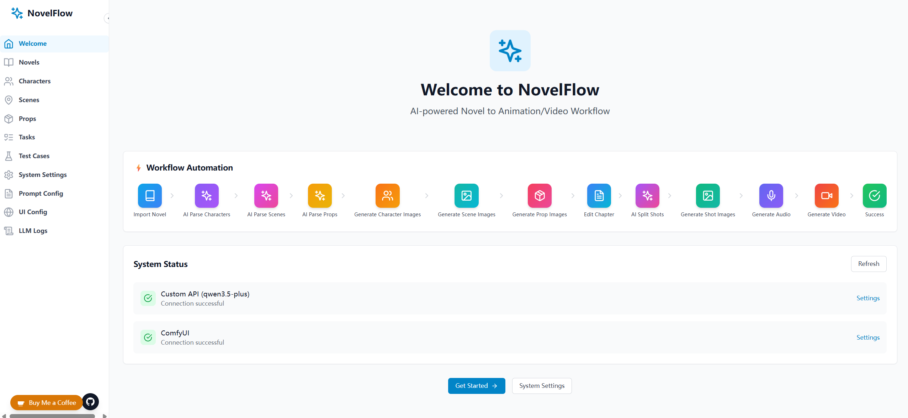

# AI-NovelFlow

**[简体中文](README.md) | [繁體中文](README_TW.md) | [English](README_EN.md) | [日本語](README_JA.md) | [한국어](README_KO.md)**

AI-Powered Novel to Video Platform

## Project Overview

NovelFlow is an AI platform that automatically converts novels into videos.

**Core Workflow:**

```
┌─────────┐    ┌───────────┐    ┌───────────┐    ┌───────────┐    ┌───────────┐
│  Novel  │ → │ AI Parse  │ → │ AI Parse  │ → │ AI Parse  │ → │ Generate  │
│         │    │ Characters│    │  Scenes   │    │   Props   │    │Character  │
│         │    │           │    │           │    │           │    │  Images   │
└─────────┘    └───────────┘    └───────────┘    └───────────┘    └───────────┘
                                                                    ↓
┌───────────┐    ┌───────────┐    ┌───────────┐    ┌───────────┐    ┌───────────┐
│  Generate │ ← │  Generate │ ← │ Gen Shot  │ ← │ AI Split  │ ← │ Generate  │
│   Video   │    │   Audio   │    │  Image    │    │   Shots   │    │  Scene    │
└───────────┘    └───────────┘    └───────────┘    └───────────┘    └───────────┘
                                                        ↑
                              ┌───────────┐    ┌───────────┐
                              │   Edit    │ ← │ Generate  │
                              │  Chapter  │    │Prop Images│
                              └───────────┘    └───────────┘
```

**Detailed Steps:**
1. **Import Novel** - Create new or import novel text (TXT, EPUB supported)
2. **AI Parse Characters** - Automatically extract character info (name, description, appearance)
3. **AI Parse Scenes** - Automatically extract scene info (scene name, environment description)
4. **AI Parse Props** - Automatically extract prop info (prop name, appearance description)
5. **Generate Character Images** - Generate AI character portraits for each character
6. **Generate Scene Images** - Generate reference images for each scene
7. **Generate Prop Images** - Generate reference images for each prop
8. **Edit Chapter / AI Split Shots** - Edit chapter content, AI automatically splits into shots
9. **Generate Shot Images** - Generate scene images based on shot descriptions
10. **Generate Audio** - Generate voiceover/sound effects for shots (optional)
11. **Generate Video** - Use Video Director to generate single-frame, first-last-frame, or multi-keyframe shot videos, then merge them into a complete video

**Key Features:**
- Support for chapter-style novel parsing
- Character consistency (maintain character appearance across multiple scenes)
- Scene consistency (maintain scene environment across multiple shots)
- Automatic shot generation and video composition

## Interface Preview



## Video Introduction

📺 <a href="https://www.bilibili.com/video/BV1VdZbBDEXF" target="_blank">Bilibili: AI-NovelFlow Novel to Video Platform Introduction</a>

📺 <a href="https://www.youtube.com/watch?v=IlMbeDme2F8" target="_blank">YouTube: AI-NovelFlow Novel to Video Platform Introduction</a>

📺 <a href="https://www.youtube.com/watch?v=DybveicQ9eQ" target="_blank">YouTube: How to Install on Windows</a>

## Community

| Telegram Group | QQ Group |
|:---:|:---:|
| <a href="https://t.me/AI_NovelFlow" target="_blank">@AI_NovelFlow</a> | 1083469624 |
|  |  |

## Tech Stack

- **Frontend**: React + TypeScript + Tailwind CSS + Vite
- **State Management**: Zustand (global state + i18n/timezone state)
- **Backend**: FastAPI + SQLAlchemy + SQLite
- **AI**: DeepSeek API / OpenAI API / Gemini API + ComfyUI
- **Video Generation**: MiniMax H3 image-to-video, first-last-frame video, and multi-keyframe video
- **i18n**: Custom i18n implementation (5 languages supported)

## Main Features

- **Novel Management**: Support creating, editing, deleting novels, automatic chapter parsing
- **Character Library**: AI auto-parse characters, support character image generation and consistency
- **Scene Library**: AI auto-parse scenes, support scene reference image generation and environment settings
- **Shot Generation**: AI auto-split chapters into shots, with batch image generation, structured editing, and state recovery
- **Video Director**: Supports single-frame, first-last-frame, three-keyframe, and four-keyframe video planning, while preserving AI call logs and final prompts
- **Video Composition**: Merge shot videos and multi-clip outputs into a complete chapter video
- **Workflow Management**: Support custom ComfyUI workflows, node mapping configuration
- **Task Queue**: Background async task processing, real-time task status monitoring
- **Preset Test Cases**: Built-in test cases like "The Little Horse Crosses the River", "Little Red Riding Hood", "The Emperor's New Clothes"
- **Multi-language Support**: Support Simplified Chinese, Traditional Chinese, English, Japanese, Korean interfaces
- **Timezone Support**: Users can customize timezone, all time displays are converted to specified timezone

## Project Structure

```
AI-NovelFlow/
├── backend/              # FastAPI Backend
│   ├── app/
│   │   ├── api/         # API Routes
│   │   ├── core/        # Core Configuration
│   │   ├── models/      # Database Models
│   │   ├── repositories/ # Data Repository Layer
│   │   ├── schemas/     # Pydantic Models
│   │   ├── services/    # Business Logic (LLM, ComfyUI)
│   │   └── utils/       # Utility Functions
│   ├── migrations/      # Database Migration Scripts
│   ├── prompt_templates/ # Prompt Template Files
│   ├── workflows/       # ComfyUI Workflow Configs
│   ├── user_workflows/  # User Custom Workflows
│   ├── user_story/      # Generated images/videos storage
│   └── main.py
├── frontend/            # React Frontend
│   └── my-app/
│       ├── src/
│       │   ├── components/  # Components
│       │   ├── i18n/        # i18n translation files
│       │   ├── pages/       # Pages
│       │   ├── stores/      # State Management
│       │   └── types/       # TypeScript Types
│       └── package.json
├── windows_gpu_monitor/ # Windows GPU Monitor Service (Optional)
│   ├── gpu_monitor.py   # GPU Monitor Service
│   ├── requirements.txt # Dependencies
│   └── start.bat        # Windows Startup Script
├── debug/workflows/     # Debug workflow samples, not loaded as system defaults
└── README.md
```

## Quick Start

### Backend Startup

```bash
cd backend
source venv/bin/activate  # Windows: venv\Scripts\activate
uvicorn app.main:app --reload --host 0.0.0.0 --port 8000
```

Backend service will run at http://localhost:8000

### Frontend Startup

```bash
cd frontend/my-app
npm install
npm run dev
```

Frontend service will run at http://localhost:5173

## API Documentation

Visit after starting backend: http://localhost:8000/docs

## Configuration

### 1. LLM API Configuration

Support multiple LLM providers:
- **DeepSeek** (default): https://api.deepseek.com
- **OpenAI**: https://api.openai.com
- **Gemini**: https://generativelanguage.googleapis.com
- **Anthropic**: https://api.anthropic.com
- **Azure OpenAI**: Custom Azure endpoint

Set API Key and proxy (if needed) in the [System Settings] page.

### 2. ComfyUI Configuration

- **ComfyUI Address**: Default http://localhost:8188
- **Workflow Configuration**: Support uploading custom workflows, need node mapping
  - Character Generation: Prompt node + Image save node
  - Scene Generation: Prompt node + Image save node + Width/Height node
  - Shot Image: Prompt node + Image save node + Width/Height node
  - Single-frame Video: Prompt node + Video save node + Reference image node + Duration node
  - First-last-frame Video: Prompt node + First image node + Last image node + Video save node + Duration node
  - Three/Four-keyframe Video: Prompt node + Start reference node + Keyframe nodes + Video save node + Duration node
  - Keyframe Image: Prompt node + Image save node + Reference image node

System workflows are stored in `backend/workflows/` and registered through `backend/app/constants/workflow.py`. User-uploaded workflows are stored in `backend/user_workflows/`. `debug/workflows/MiniMax H3/` is only for debugging and workflow comparison; it is not loaded as system defaults.

#### 2.1 Model Files

Directory is based on `ComfyUI/models/...`; if you use ComfyUI-Manager, it generally scans these directories as well.

| Model Filename | Type | Main Purpose | Workflows Used | Recommended Directory |
|---------------|------|-------------|----------------|---------------------|
| `minimax_h3_ref2va_bf16.safetensors` | diffusion model | MiniMax H3 reference-to-video model | Single-frame, first-last-frame, three-keyframe, and four-keyframe video workflows | `models/diffusion_models/` |
| `qwen3vl_32b_minimax_h3_int8_convrot.safetensors` | text encoder | MiniMax H3 text/vision encoding | MiniMax H3 video workflows | `models/text_encoders/` |
| `minimax_h3_video_vae_fp16.safetensors` | video VAE | MiniMax H3 video VAE | MiniMax H3 video workflows | `models/vae/` |
| `minimax_h3_audio_vae_fp32.safetensors` | audio VAE | MiniMax H3 audio VAE | MiniMax H3 video workflows | `models/vae/` |
| `minimax_h3_fl2v_lightx2v_turbo_4step_v0.1_comfy.safetensors` | LoRA | MiniMax H3 acceleration LoRA | MiniMax H3 fast workflows | `models/loras/` |
| `ae.safetensors` | VAE / AE | Used as VAE/AE in Z-image-turbo and some default character workflows | Z-image-turbo Single Image / System Default - Character | `models/vae/` |
| `flux-2-klein-9b.safetensors` | UNet | Flux2-Klein image edit and shot image generation | Shot image, keyframe image, default character workflows | `models/unet/` |
| `flux2-vae.safetensors` | VAE | Flux2 VAE | Flux2-Klein image edit and shot image workflows | `models/vae/` |
| `qwen_3_8b.safetensors` / `qwen_3_8b_fp8mixed.safetensors` | text encoder | Flux2 text encoding | Flux2-Klein image edit and shot image workflows | `models/clip/` |
| `qwen_image_edit_2511_fp8mixed.safetensors` | diffusion model | Qwen-Edit-2511 image editing | Qwen-Edit-2511 shot reference workflows | `models/diffusion_models/` |
| `Qwen-Image-Edit-2511-Lightning-4steps-V1.0-fp32.safetensors` | LoRA | Qwen-Edit-2511 4-step acceleration | Qwen-Edit-2511 shot reference workflows | `models/loras/` |
| `qwen_image_vae.safetensors` | VAE | Qwen Image VAE | Qwen-Edit-2511 shot reference workflows | `models/vae/` |
| `qwen_2.5_vl_7b_fp8_scaled.safetensors` | text encoder | Qwen-Edit-2511 text/vision encoding | Qwen-Edit-2511 shot reference workflows | `models/clip/` |
| `z_image_turbo_bf16.safetensors` | UNet | Z-image-turbo single image generation UNet | Z-image-turbo Single Image / System Default - Character | `models/unet/` |
| `qwen_3_4b.safetensors` | text encoder | Z-image-turbo text encoding | Z-image-turbo Single Image / System Default - Character | `models/clip/` |
| `Qwen3.8-27B-Q4_K_M.gguf` / `mmproj-F16.gguf` | LLM / projector | Local LLM prompt expansion in debug workflows | `debug/workflows/MiniMax H3/` LLM debug workflows | `models/LLM/` |

#### 2.2 Third-Party Node Packages

| Third-Party Node Package | GitHub Repository | Node class_type in Workflows |
|-------------------------|------------------|------------------------------|
| **MiniMax H3** | ComfyUI MiniMax H3 nodes | `MiniMaxH3ReferenceToVideo`, `MiniMaxH3SigmaShift`, `MiniMaxH3MemoryEfficientSageAttentionPatch`, `MiniMaxH3PromptEnhancerT8` |
| **Flux2 / Qwen Image Edit** | Flux2 and Qwen-Edit ComfyUI nodes | `Flux2Scheduler`, `EmptyFlux2LatentImage`, `TextEncodeQwenImageEditPlusAdvance_lrzjason` |
| **VideoHelperSuite / VHS** | [Kosinkadink/ComfyUI-VideoHelperSuite](https://github.com/Kosinkadink/ComfyUI-VideoHelperSuite) | `VHS_VideoCombine` |
| **Easy-Use** | [yolain/ComfyUI-Easy-Use](https://github.com/yolain/ComfyUI-Easy-Use) | `easy int`, `easy cleanGpuUsed`, `easy showAnything` |
| **LayerStyle / LayerUtility** | [chflame163/ComfyUI_LayerStyle](https://github.com/chflame163/ComfyUI_LayerStyle) | `LayerUtility: ImageScaleByAspectRatio V2` |
| **Comfyroll** | [Suzie1/ComfyUI_Comfyroll_CustomNodes](https://github.com/Suzie1/ComfyUI_Comfyroll_CustomNodes) | `CR Prompt Text`, `CR Text` |
| **FizzNodes / ConcatStringSingle** | [FizzleDorf/ComfyUI_FizzNodes](https://github.com/FizzleDorf/ComfyUI_FizzNodes) | `ConcatStringSingle` |
| **comfyui-various / JWInteger** | [jamesWalker55/comfyui-various](https://github.com/jamesWalker55/comfyui-various) | `JWInteger` |
| **ReservedVRAM** | [Windecay/ComfyUI-ReservedVRAM](https://github.com/Windecay/ComfyUI-ReservedVRAM) | `ReservedVRAMSetter` |
| **Qwen3-VL-Instruct / Qwen3_VQA** | [luvenisSapiens/ComfyUI_Qwen3-VL-Instruct](https://github.com/IuvenisSapiens/ComfyUI_Qwen3-VL-Instruct) | `Qwen3_VQA` |
| **Comfyui-zhenzhen** | [T8mars/Comfyui-zhenzhen](https://github.com/T8mars/Comfyui-zhenzhen) | `Zhenzhen_nano_banana`, `Zhenzhen API Settings` |

### 3. Windows GPU Monitor (Optional)

If ComfyUI runs on a remote Windows server, you can deploy the `windows_gpu_monitor` service to get real-time GPU status.

**Features**:
- Real-time monitoring of GPU usage, temperature, VRAM
- Monitor memory usage
- Display queue task count

**Deployment Steps**:

```bash
cd windows_gpu_monitor

# Install dependencies
pip install -r requirements.txt

# Start service
start.bat
```

Service runs at http://localhost:5000 by default

**Access Test**:
- Home: http://localhost:5000/
- GPU Status: http://localhost:5000/gpu-stats

### 4. Prompt Template Configuration

Support customization:
- AI parse characters system prompt
- Character generation prompt templates
- Chapter split prompt templates

### 5. Internationalization and Timezone Settings

**Language Settings**:
- Simplified Chinese (zh-CN)
- Traditional Chinese (zh-TW)
- English (en-US)
- 日本語 (ja-JP)
- 한국어 (ko-KR)

**Timezone Settings**:
- Support major global timezones
- All time displays (task list, LLM logs, etc.) converted to specified timezone
- Backend stores UTC time uniformly, frontend dynamically converts based on user settings

Configure in [System Settings] → [Language & Timezone] page.

## Development Roadmap

- [x] Project Initialization
- [x] Basic Pages (Welcome, Config, Novel List)
- [x] Backend API Framework
- [x] DeepSeek API Integration (Text Parsing)
- [x] ComfyUI API Integration (Image/Video Generation)
- [x] Task Queue System
- [x] Character Library Management
- [x] Workflow Management System
- [x] JSON Parse Logs
- [x] Preset Test Cases
- [x] Multi-language Support (CN/EN/JP/KR/TW)
- [x] Timezone Support
- [x] Video Director (single-frame, first-last-frame, three/four-keyframe, multi-clip serial generation)
- [x] Persistent batch shot image queue (service restart recovery and batch cancellation)
- [x] Video Composition (shot video and multi-clip merging)

## Usage Instructions

### 1. Create Novel
- Click [Create Novel] to create a novel
- Or select preset test cases for quick experience

### 2. AI Parse Characters, Scenes and Props
- Click [AI Parse Characters] on novel detail page to extract character info
- Click [AI Parse Scenes] to extract scene info
- Click [AI Parse Props] to extract prop info
- Support chapter range selection and incremental update

### 3. Generate Character, Scene and Prop Images
- Enter [Character Library] page, click [AI Generate All Character Images]
- Enter [Scene Library] page, click [Generate All Scene Images]
- Enter [Props Library] page, click [Generate All Prop Images]

### 4. Edit Chapter and AI Split Shots
- Enter [Chapter Generation] page, click [AI Split Shots] to automatically split into shots
- Enter [Chapter Edit] page to edit chapter content, supports incremental parsing of characters, scenes and props during editing

### 5. Generate Shot Images
- Click [Generate All Shot Images] to create a persistent batch task
- You can select only missing shots, or reuse existing AI prompts to skip LLM calls

### 6. Generate Audio (Optional)
- Click [Generate All Audio] to generate voiceover/sound effects for shots

### 7. Generate Video
- Use Video Director in [Video Generation] to plan the video mode
- Single-frame mode reuses the primary storyboard image
- First-last-frame mode reuses the primary storyboard as START and requires generating the END keyframe first
- Multi-keyframe mode splits execution windows by max clip duration; each clip uses 3 or 4 keyframes and runs serially
- Click [Merge Video] to combine all clips into a complete video

## Contributing

Contributions are welcome! Please read the [Contributing Guide](docs/CONTRIBUTE_GUIDE_EN.md) to learn how to participate in development.

## License

This project is licensed under the GNU General Public License v3.0 - see the [LICENSE](LICENSE) file for details.
